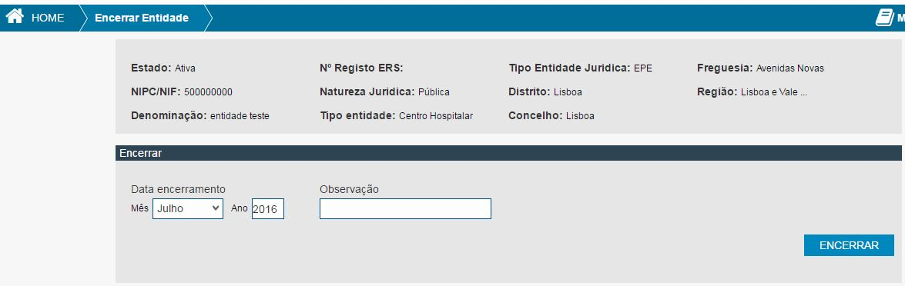
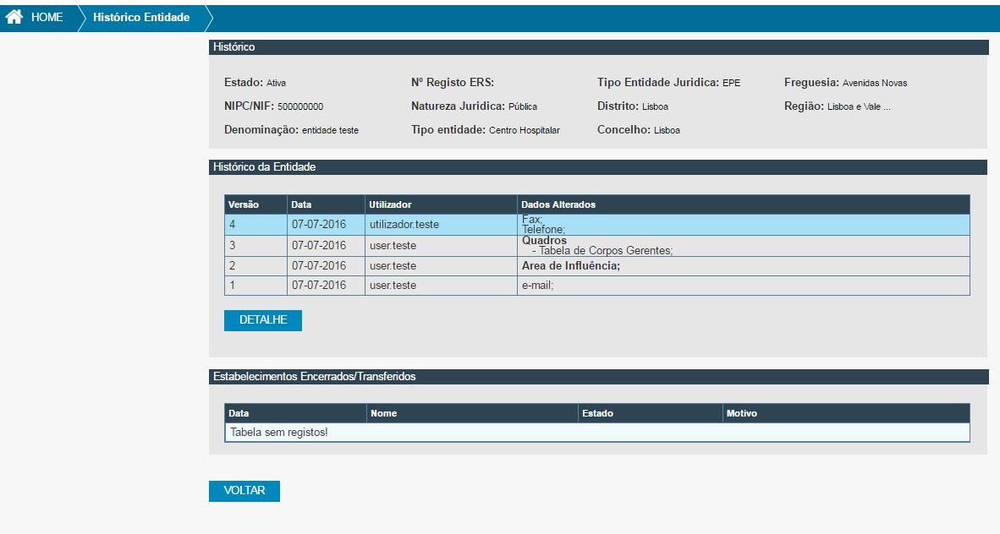

# 6.Entidades

É neste módulo que serão feitas ações sobre as entidades.

## 6.1.Criar Entidade

Para poder criar uma entidade o utilizador deve preencher,pelo menos, os campos obrigatórios e clicar em **CRIAR**;

|  | Campos Obrigatórios ([Fig. 10](#fig10))               |   |   |   |
|----|--------------------------------------------|---|---|---|
| a) | Campo de identificação do tipo de pesquisa |   |   |   |
| b) | NIPC da entidade a criar |   |   |   |

 Fig.10 Pesquisa Entidade 

  
  
Se ainda não existir a entidade, o utilizador será encaminhado para a página de criação de entidade, com os dados pre-preenchidos da página de pesquisa [Fig. 10](#fig10). 
Deverá preencher os campos obrigatórios para poder efetuar o registo da entidade.
Após o registo dos dados deve clicar em **GUARDAR** para gravar a entidade. Após clicar irá ser notificado com o resultado da operação.

|    | Campos Obrigatórios da ([Fig. 11](#fig11))                  |                 |             |   |
|----|-----------------------------------------------------|-----------------|-------------|---|
| a) | Denominação                                         |                 |             |   |
| b) | Natureza Jurídica                                   |                 |             |   |
| c) | Tipo Entidade (só se natureza jurídica = Pública)   |                 |             |   |
| &nbsp;&nbsp;  |                                                 |**Natureza Juridica**|**Tipo Entidade**|   |
|----|-----------------------------------------------------|-----------------|-------------|---|
| d) | ARS                                                 |    Pública      |ACES              |   |
|    |                                                     |                 |Centro Hospitalar |   |
|    |                                                     |                 |Hospital          |   |
|    |                                                     |                 |ULS               |   |
| e) | Tipo Entidade                                       |    Pública      |ACES              |   |
|    |                                                     |                 |Centro Hospitalar |   |
|    |                                                     |                 |Hospital          |   |
|    |                                                     |                 |ULS               |   |
| e) | Integra                                             |    Pública      |ACES              |   |
| g) | Matricula                                           |    Privada      |                  |   |
|    |                                                     |    IPSS         |                  |   |
|    |                                                     |  Cooperativa    |                  |   |
| h) | Volume de negócios global                           |    Privada      |                  |   |
|    |                                                     |    IPSS         |                  |   |
|    |                                                     |  Cooperativa    |                  |   |
| i) | Tipo de Atividade Principal (CAE)                   |    Privada      |                  |   |
|    |                                                     |    IPSS         |                  |   |
|    |                                                     |    Cooperativa  |                  |   |
| j) | Tipo de Atividade Secundária (CAE)                  |    Privada      |                  |   |
|    |                                                     |    IPSS         |                  |   |
|    |                                                     |    Cooperativa  |                  |   |
| k) | Morada                                              |                 |             |   |
| l) | Código Postal                                       |                 |             |   |
| m) | Distrito                                            |                 |             |   |
| n) | Concelho                                            |                 |             |   |
| o) | Freguesia                                           |                 |             |   |
| p) | Telefone                                            |                 |             |   |
| q) | Fax                                                 |                 |             |   |
| r) | E-mail                                              |                 |             |   |
| s) | Site                                                |                 |             |   |
| t) | Capital estatuário ou social € (Exceto natureza jurídica = Pública e tipo de entidade = ACES)|         |             |   |
| u) | Fonte de informação                                 |                 |             |   |
| v) | existe Equipamento Pesado?                          |                 |             |   |
| x) | Identificação dos corpos Gerentes/ Conselho de administração    |     |             |   |
| y) | Identificação dos Sócios/Acionistas (só se natureza jurídica = Privada) |     |     |   |

 Fig.11 Criar Entidade 

## 6.2.Editar Entidade

A página de edição de uma entidade está disponível através da consulta de entidade clicando no botão “EDITAR ENTIDADE” ([Fig. 5](#fig5)) ou se tiver acesso à pesquisa de entidades pode navegar diretamente para a edição após selecionar uma entidade da lista de resultados e clicar no botão **EDITAR** ([Fig. 9](#fig9) ).
A edição deve respeitar o preenchimento dos campos obrigatórios identificados no ponto [6.1 Criar Entidade](#criar-entidade).
No final da edição o utilizador para gravar as alterações deve clicar no botão **GUARDAR**. Após clicar irá ser notificado com o resultado da operação.

## 6.3.Consultar Entidade
A página de consulta de uma entidade pode ser a página de entrada no SGES ([Fig. 5](#fig5)) ou se tiver acesso à pesquisa de entidades pode navegar diretamente para a consulta após selecionar uma entidade da lista de resultados e clicar no botão **CONSULTAR** ([Fig. 9](#fig9) ).

## 6.4.Encerrar Entidade
Para encerrar uma entidade tem pesquisar pela mesma e depois de a selecionar na lista de resultados deve clicar no botão **ENCERRAR** ([Fig. 9](#fig9) ).
Uma vez na página de **Encerrar Entidade** ([Fig. 12](#fig12)) deve preencher os campos *Mês*, *Ano*, *Observações* se for necessário e depois clicar no botão **Encerrar**. 
Após clicar no botão surge alerta a questionar se pretende mesmo encerrar a entidade, se confirmar irá ser notificado com o resultado da operação.

 Fig. 12 - Encerrar entidade

## 6.5.Histórico Entidade
A página de histórico de uma entidade pode ser acedida através da pesquisa de entidades, selecionado uma entidade da lista de resultados e clicando no botão **HISTÓRICO**  ([Fig. 9](#fig9) ).
Uma vez na página de histórico ([Fig. 13](#fig13)) poderá visualizar todas as versões resultantes da edição da entidade, bem como a identificação dos campos alterados.

 Fig.13 - Histórico de Entidade

Estão também registados os estabelecimentos transferidos e encerrados da entidade. 

